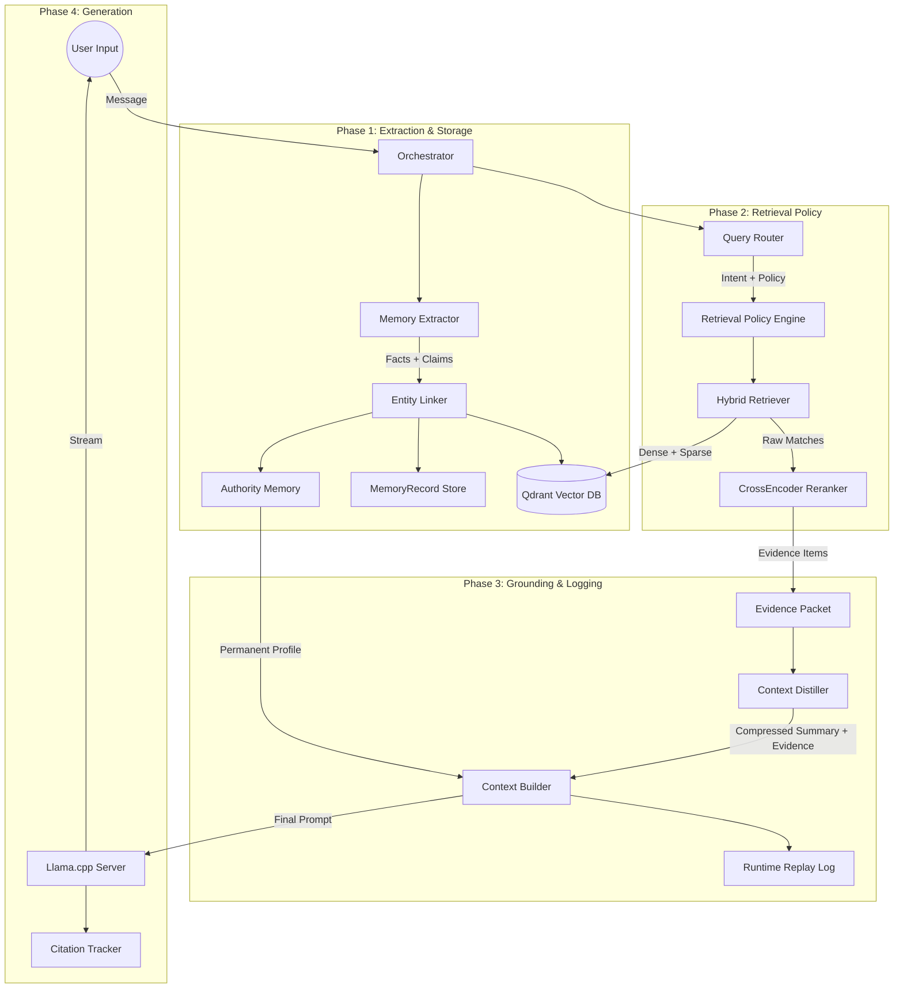

# ENML System Architecture & Workflow

This document provides a technical deep-dive into the External Neural Memory Layer (ENML), explaining its components, storage layers, and the exact step-by-step workflow of how it processes user interactions to form a continuous, intelligent memory stream.

---

## 1. System Overview

ENML is designed as a modular local memory pipeline that captures interactions, stores them in multiple memory forms, retrieves by policy, grounds answers with explicit evidence, and logs the runtime for later evaluation.



---

## 2. Core Components

| Component | Responsibility |
|---|---|
| **Memory Extractor** | Uses layered extraction (LLM, rules, regex fallback) to produce facts robustly. |
| **Authority Memory** | Deterministic JSON storage for the AI's identity and the User's core identity to prevent data drift or hallucination. |
| **MemoryRecord Store** | Rich local store for facts, semantic claims, episodic summaries, and lifecycle metadata. |
| **Hybrid Retriever** | Polls Qdrant using dense and sparse retrieval, then uses reranking and feedback-aware scoring. |
| **CrossEncoder Reranker** | Takes the broad results from the Retriever and strictly scores them based on relevance to the exact query, elevating the most critical memories. |
| **Query Router** | Intent classification for personal memory, documents, projects, research, and conversation/general tasks. |
| **Retrieval Policy Engine** | Chooses retrieval depth, memory classes, and answer policy based on the query and model profile. |
| **Context Distiller** | Compresses relevant evidence when beneficial for the active model profile. |
| **Citation Tracker / Runtime Replay** | Logs what was retrieved, what was cited, and how long each stage took. |
| **Orchestrator** | The central engine that ties everything together and triggers episodic/lifecycle background work. |

---

## 3. Live Flow Example: "The Pet Protocol"

To truly understand ENML's architecture, let's walk through a live example. Imagine a user interacting with ENML across two different days.

### Day 1: The Initial Fact

**User says:** *"My name is Flex and I got a new pet lizard today, its name is Colu. Also, I'm working on the ENML project in Python."*

#### Step 1: Fact Extraction (Background)
The `Orchestrator` receives the message and sends it to the `MemoryExtractor`. A fast background LLM parses it into semantic triples:
1. `{"subject": "user", "predicate": "has_name", "object": "Flex", "confidence": 0.99, "type": "identity"}`
2. `{"subject": "user", "predicate": "has_pet", "object": "lizard", "confidence": 0.95, "type": "fact"}`
3. `{"subject": "lizard", "predicate": "has_name", "object": "Colu", "confidence": 0.90, "type": "identity"}`
4. `{"subject": "user", "predicate": "has_project", "object": "ENML", "confidence": 0.95, "type": "project"}`
5. `{"subject": "user", "predicate": "has_skill", "object": "Python", "confidence": 0.90, "type": "skill"}`

#### Step 2: Routing & Storage
The `MemoryManager` routes these facts:
* `"has_name Flex"` is stored in `authority/profile.json` for permanent absolute priority.
* The pet and project facts are sent to the `EntityLinker`. Vectors are generated using the local `BGE-base-en` embedding model.
* The `Retriever` inserts these as points into `Qdrant` along with Sparse BM25 keywords and timestamp metadata.

#### Step 3: Standard Response
The system responds normally: *"Hello Flex! Congratulations on your new lizard, Colu. How's the ENML project coming along?"*

---

### Day 2: The Recall

24 hours later, the user opens a new session.

**User says:** *"Can you write a Python script that prints a greeting for my lizard?"*

#### Step 1: Query Intent Routing
The `Orchestrator` asks the `QueryRouter` to classify the intent. The router recognizes this as a combination of personal knowledge and project discussion. It targets the `knowledge_collection` while allowing general fallback.

#### Step 2: Hybrid Retrieval
The `Retriever` queries Qdrant using the text *"Can you write a Python script that prints a greeting for my lizard?"*
* **Dense Vectors** find memories related to "pets", "Python", and "writing code".
* **Sparse BM25** looks for exact keyword matches for "lizard" and "Python".

Qdrant returns 15 potential memory chunks from the user's history, including the Day 1 facts, plus some random older facts about other animals or languages.

#### Step 3: Memory Aging
The `Retriever` looks at the timestamps. Facts from 3 years ago suffer a minor decay penalty. The fact about the lizard was stored yesterday, so it retains its high score.

#### Step 4: CrossEncoder Reranking
The 15 retrieved facts are paired with the user's query and passed through the `BAAI/bge-reranker-base` model. 
* The reranker gives a massive relevance score to the fact `{"subject": "lizard", "predicate": "has_name", "object": "Colu"}`.
* Irrelevant retrieved facts are discarded. The top 5 facts remain.

#### Step 5: Evidence Packet + Distillation
Instead of flattening everything into raw triples, ENML assembles an evidence packet with identity, facts, episodic context, and metadata. Distillation may compress this further for the active model profile.

#### Step 6: Prompt Construction
The `ContextBuilder` constructs the final invisible system prompt:
```text
System Time: 2026-03-10T09:34:50

Your identity:
Name: Jarvis

User's identity:
Name: Flex

<retrieved_facts>
[id=...] User's pet lizard is named Colu.
[id=...] User codes in Python.
</retrieved_facts>
```

#### Step 7: Final Generation
The `Llama.cpp` server processes the prompt and streams the output directly to the user:
> *"Sure Flex! Here is a simple Python script to greet Colu:"*
> ```python
> print("Hello, Colu the lizard!")
> ```

---

## 4. Hardware Resources & VRAM Offloading

Because ENML relies on multiple localized AI models, it utilizes a Dynamic VRAM reservation system.

1. **Strict Buffer:** A rigid 300 MB margin is enforced using `llama-server`'s native `--fit-target` argument to guarantee OS UI stability, rather than relying on bash arithmetic.
2. **Native Layer Optimization:** Because the buffer is native, the `FINAL_NGL` (GPU Layers) integer is defaulted to a massive threshold (999). This forces the C++ engine to automatically optimize exactly how many layers it can safely cram into whatever your *current* Free VRAM is.
3. **Offline/Online Adaptation:** By using native fitting on launch, the server seamlessly adapts to whether your other heavy systems (like Background Automation) are currently online or offline, without hardcoded static reservations.
4. **CPU Models:** The embedding and reranker models run on CPU via `sentence-transformers`, reserving VRAM for the main conversational model.
